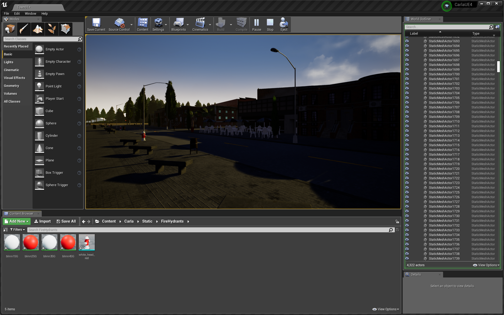

# Simulation for Detection

Use Carla simulator to create synthetic road images that can be used to train object detectors

-------------------
### Table of Contents
- [Notes and Disclaimers](#notes_and_disclaimers)
- [Steps to run this project](#steps)
    1. Install everything and test the installation
    2. Set up and launch the Carla simulator server in Unreal Engine
    3. Prepare and connect the Python client, and Collect Data
    4. Train the model with data collected from step 3
---

<a name='notes_and_disclaimers'></a>

## Notes and Disclaimers
0. This project is developed on Linux system, *Ubuntu 18.04.3 LTS* to be specific.
1. The instructions below assume that you installed everything in the root directory, which means
    - the carla directory is at `~/carla`
    - the Unreal Engine is at `~/UnrealEngine_4.24`
    - this repo *simulation4detection_v2* is at `~/simulation4detection_v2`

    If you installed anything elsewhere, be sure to swap in the correct directory paths.
2. Prepare up to 100 GB in the directory where you wish to store this entire project. 
3. We are using Carla 0.9.6 and Unreal Engine 4.22. For the latest and the greatest, please checkout the official Carla Document [How to build the latest CARLA in Linux](https://carla.readthedocs.io/en/latest/how_to_build_on_linux/).

-------------------

<a name='steps'></a>

## Steps to run this project

#### Step 1: Install everything and test the installation
1. Follow the [instructions to Install Carla Simulator 0.9.9 and Unreal Engine 4.22](docs/installation.md).
2. Test connecting a Python client with the carla simulator, by following the [instructions for using a Python client to control the Carla simulator](docs/test_installation.md)

#### Step 2: Set up and launch the Carla simulator server in Unreal Engine
1. Before launch the Unreal Engine editor, choose which town/map to load, specifically:

    - Open the file *DefaultEngine.ini* in `~/carla/Unreal/CarlaUE4/Config/DefaultEngine.ini`. 
    
    - Inside the file, change the town numbers in the following lines:
        ```
        EditorStartupMap=/Game/Carla/Maps/Town01.Town01
        GameDefaultMap=/Game/Carla/Maps/Town01.Town01
        ServerDefaultMap=/Game/Carla/Maps/Town01.Town01

        TransitionMap=/Game/Carla/Maps/Town01.Town01
        ```
        *these lines are listed in commit [df83fb53](https://gitlab.com/cmertz/simulation4detection_v2/commit/df83fb534de2fd537f8ade9dd229e36302c58dcc).

2.  Launch the Unreal Engine editor
    - Open a terminal window and run
        ```bash
        $ cd ~/carla
        $ make launch
        ```

3. Add Fire Hydrants onto the map
    1. At the bottom of the Unreal Engine Editor, you will find the Content Browser section. 
    2. Navigate to path `Content/carla/Static`. 
    3. Once you are in the **Static** folder, click the green **Add New** button and click **New Folder**. Name the folder `FireHydrants`. The name must be FireHydrants because the Python client will use this folder name to tag fire hydrant objects.
    4. Navigate into this `FireHydrants` folder.
    5. Click **Import** and find the [fire hydrant mesh](mesh/fire_hydrant_mesh/white_head_red.obj) inside this directory.
    6. Now your content browser should look like this 
    7. Drag the mesh onto the map and place them to the desired Locations.
    8. Here is a [detailed instruction](https://github.com/chrmertz/synth_train_data) for reconstructing 3D object.

#### Step 3: Prepare and connect the Python client
1.  Configure the PythonAPI to recognize Fire Hydrants. According to Carla.org documentation: "Adding new tags: At the moment adding new tags is not very flexible and requires to modify the C++ code. Add a new label to the *ECityObjectLabel* enum in *Tagger.h*, and its corresponding filepath check inside GetLabelByFolderName() function in *Tagger.cpp*."
    - Follow commit [c46e8970](https://gitlab.com/cmertz/simulation4detection_v2/commit/c46e89709e69e880ab195272e1bb4e2f245e605d) and change the *tagger.h*, *tagger.cpp* and *CityScapesPalette.h* files in **`~/carla`** directory. 
    - Update the installed Carla Python API.
    ```bash
    $ cd ~/carla
    $ make LibCarla
    $ make PythonAPI.3
    $ pip3 uninstall carla
    $ cp PythonAPI/carla/dist/carla-0.9.9-py3.6-linux-x86_64.egg ~/simulation4detection_v2/carla/PythonAPI/carla/dist/carla-0.9.9-py3-linux-x86_64.egg 
    ```
    - After this step, the Carla segmentation camera will only detect fire hydrants in orange RGB(220, 110, 0). All other objects will be black.

2. Click **Play** button at the top tool bar in Unreal Engine.
3. Launch Python Agent to collect data
    ```bash
    $ cd ~/simulation4detection_v2/carla/PythonAPI
    $ python3 examples/collectData.py
    ```
    A window will open with the agent's camera view. At the same time two new folders `_out_rgb` and `_out_seg` are created, where the output camera images will be stored.

#### Step 4: Train the model with data collected from step 3
1. Install [CUDA 11.0](https://developer.nvidia.com/cuda-11.0-download-archive)
    - Select Linux -> x86_64 -> Ubuntu -> 18.04 -> runfile(local) (Might be different depend on machine configuration)
    ```bash
    $ cd ~/Desktop
    $ wget http://developer.download.nvidia.com/compute/cuda/11.0.2/local_installers/cuda_11.0.2_450.51.05_linux.run
    $ sudo sh cuda_11.0.2_450.51.05_linux.run
    ```
    - Select Continue -> type accept -> select only CUDA 11.0 (deselect all other options)
    - Add CUDA to system PATH
    ```bash
    $ vim ~/.bashrc
    # Copy paste the following 
    export PATH=/usr/local/cuda-11.0/bin${PATH:+:${PATH}}
    export LD_LIBRARY_PATH=$LD_LIBRARY_PATH:/usr/local/cuda-11.0/lib64
    export LIBRARY_PATH=$LIBRARY_PATH:/usr/local/cuda-11.0/lib64
    ```
    - Log out and log back in

2. Install Nvidia Driver 450
    - Open Software & Updates
    - Go to tab Additional Drivers
    - Select Nvidia Driver 450
    - Apply changes

3. Check installation
    ```bash
    $ nvcc --version # should display 11.0
    $ nvidia-smi # should display CUDA 11.0 and Nvidia driver 450
    ```

4. Install PyTorch
    ```bash
    $ pip3 install torch==1.7.0+cu110 torchvision==0.8.1+cu110 torchaudio===0.7.0 -f https://download.pytorch.org/whl/torch_stable.html
    ```

5. Install Detectron2
    ```bash
    $ cd ~/Desktop
    $ git clone https://github.com/facebookresearch/detectron2.git
    $ python3 -m pip install -e detectron2
    ```

6. Run main scripts
    - Edit `simulation4detection_v2/detectron2/main.py` as needed 
    ```bash
    $ cd ~/simulation4detection_v2/detectron2
    $ python3 main.py
    ```
